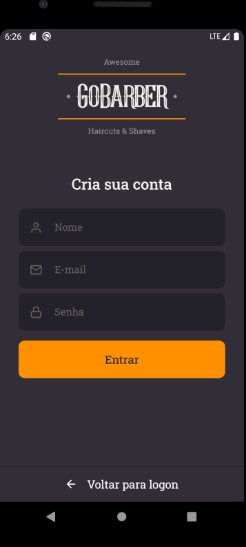

## GoBarber - Nova Jornada GoStack 🚀️

### Sobre o Projeto

GoBarber é uma aplicação para agendar e gerenciar serviços de beleza, onde prestadores de serviços podem se cadastrar, e usuários poderão marcar agendamentos com estes provedores.

<div align="center" style="margin-bottom: 20px;">
    
</div>

Tecnologias usadas:

-   [ReactJS](https://reactjs.org/)
-   [React Native](https://reactnative.dev/)
-   [NodeJS](https://nodejs.org/en/)
-   [TypeScript](https://github.com/microsoft/TypeScript)
-   [React-icons](https://react-icons.netlify.com/)
-   [Axios](https://github.com/axios/axios)
-   [Styled Components](https://styled-components.com/)
-   [Docker](https://www.docker.com/)
-   [JWT](https://jwt.io/)
-   [Yup](https://github.com/jquense/yup)
-   [PostgresSQL](https://www.postgresql.org/)
-   [MongoDB](https://www.mongodb.com/)
-   [Redis](https://redis.io/)
-   [Nodemailer](https://nodemailer.com/about/)
-   [TypeORM](https://typeorm.io/#/)
{...}

Telas da aplicação:

-  Web:

<div align="center">
    
    
    
    
    
    
</div>

-  Mobile:

<div align="center">
    
    
    
    
    
    
</div>

## :zap: Executando o Projeto
#### Clonando o projeto
```sh
$ git clone https://github.com/johnnycruz-dev/GoBarber.git
$ cd gobarber
```
#### Iniciando a API
```sh
$ cd api

# Antes disso precisar ter o Docker instalado em sua máquina.
# Com o docker instalado, basta inicializar as imagens do "postgres", "mongodb" e "redis".
# Após configurar as imagens do docker podemos continuar.

# Rodando as migrations para o banco de dados e iniciando o projeto
$ yarn && yarn typeorm migration:run && yarn dev:server
```

#### Iniciando o Frontend
```sh
$ cd web
$ yarn && yarn start
```
#### Iniciando o Mobile(Android)
```sh
$ cd mobile
$ yarn && yarn android && yarn start
```